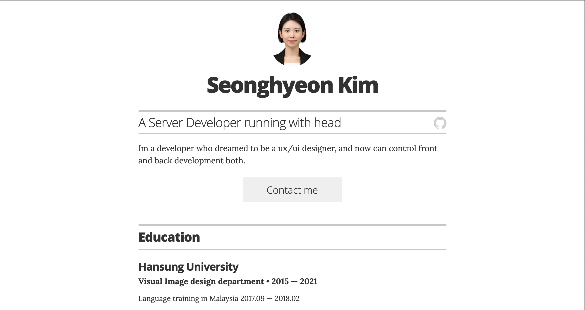
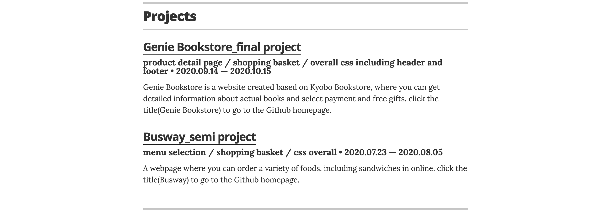
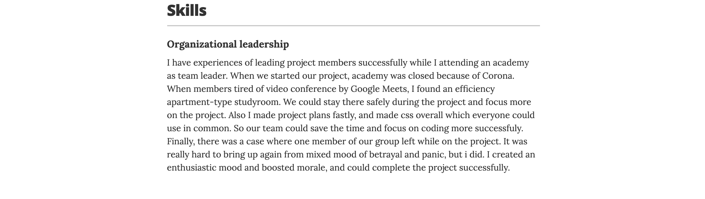

# 머리로 뛰는 개발자, 김성현 입니다

*A simple Jekyll + GitHub Pages powered resume template.*

학교에서 UX/UI디자인 관련 수업을 들은 뒤 웹사이트의 디자인을 넘어 본격적인 웹사이트의 구동에 흥미를 가지게 되었습니다.
신청한 1년동안의 유예기간동안 학원에서 관련 지식을 쌓는 동시에 정처기 시험을 준비하여 개발자 꿈을 향해 다가갈 수 있었습니다.

학원에서 [Genie Bookstore] 파이널 프로젝트와 [Busway] 세미 프로젝트를 진행하였습니다.

[Genie Bookstore]는 교보문고를 모티브로 하여 만든 웹사이트로, 
실제 상품(책)에 대한 자세한 정보를 얻을 뿐만 아니라, 결제방법을 택하여 결제를 진행하고 사은품을 선택하는등의 활동이 실제 가능한 웹사이트 입니다.
저는 상품 상세페이지 및 장바구니와 CSS 부분을 일부 맡았습니다.
프로젝트에 대한 자세한 사항은 제목(Genie Bookstore)을 클릭하여 깃허브 홈페이지에서 확인하실 수 있습니다.

[Busway]는 온라인으로 직접 음식을 선택하여 주문할 수 있는 샌드위치 판매 웹사이트 입니다
저는 상품 페이지 및 장바구니 및 일부 CSS를 맡았습니다.
프로젝트에 대한 자세한 사항은 제목(Busway)을 클릭하여 깃허브 홈페이지에서 확인하실 수 있습니다.

